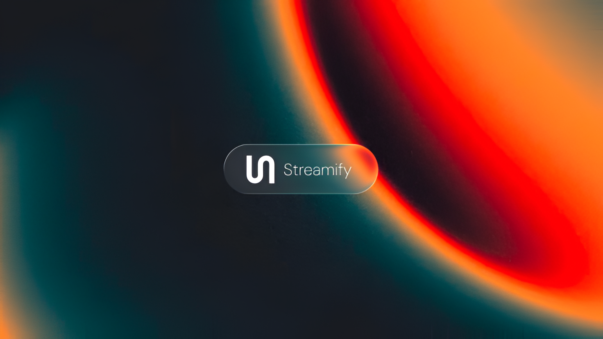

<p align="center">
  
</p>

<h1 align="center">Streamify Desktop</h1>

<p align="center">
  A native desktop music app for Windows, macOS, and Linux — search, playback, library, and lyrics in one install.
</p>

<p align="center">
  <a href="#english">English</a> |
  <a href="#فارسی">فارسی</a>
</p>

<p align="center">
  
  
  
</p>

<p align="center">
  
  
  
  
  
</p>

<p align="center">
  
  
  
  
</p>

<p align="center">
  <a href="https://t.me/StreamifyPlayer" target="_blank">
    
  </a>
</p>

<p align="center">
  <a href="https://github.com/ErfanBagheri404/Streamify-Desktop/releases/latest">
    
  </a>
</p>

---

## English

### Overview

Streamify Desktop is the Streamify listening experience as a native app: install it, launch it, and search, play, organize, and read lyrics for music across multiple sources — with system media keys, a system tray, and automatic updates.

### Why It Stands Out

| Area | What you get |
| --- | --- |
| Install | One installer plus a portable build that runs from anywhere with no install |
| Discovery | Unified search across YouTube, SoundCloud, and JioSaavn |
| Playback | Queue management, repeat modes, seek, volume, fullscreen, and provider-aware playback |
| Library | Liked songs, custom playlists, recently played tracks, and local persistence |
| Context | Artist pages, collection pages, caching, and playback state recovery |
| UX | Desktop-focused layout, mini player, side panels, and bilingual UI |
| Lyrics | Timed lyrics support for a more immersive fullscreen player experience |
| Desktop | Native menu bar, system tray, media keys, single-instance lock, and window bounds memory |
| Updates | Built-in updater that finds a new release, downloads it, and restarts into the new version |

### Tech Stack

- Desktop shell: `Electron 35`, `TypeScript`, `electron-builder`
- Frontend: `Next.js 16`, `React 19`, `TypeScript`, `Tailwind CSS 4`
- Backend: `Express 5`, `TypeScript`, `Undici`, bundled with `esbuild`
- Media: native audio element, `hls.js`, SoundCloud widget playback, DRM and proxy routes
- State and persistence: React contexts, `localStorage`, runtime config bootstrapping, client-side caching
- Delivery: GitHub Actions matrix build (Windows, macOS, Linux) publishing to GitHub Releases

### Architecture Snapshot

```text
.
|-- app/            Next.js app — routes, UI components, playback, library, provider logic
|-- api/            music backend — search aggregation, stream resolution, media proxying
|-- electron/       desktop shell — main process, preload bridge, native menu, tray, updater
|-- scripts/        build helpers — standalone packaging, icon rendering, CDP verification
|-- .github/        CI — builds all three platforms and publishes a release on every main push
|-- README.md
|-- LICENSE
```

### Main Product Areas

- `app/app/page.tsx`: home experience and recommendation surfaces
- `app/app/search`: multi-source search flow and results UI
- `app/app/library`: liked songs, playlists, and local library interactions
- `app/app/artist` and `app/app/collection`: detail pages for artists and collections
- `app/app/contexts/AudioContext.tsx`: queue, repeat, playback, persistence, and player state
- `electron/main.js`: app lifecycle, backend and frontend boot, media keys, tray, self-update
- `electron/preload.js`: the isolated-world bridge between the app UI and the desktop shell

### Downloads

Grab the latest build from **[Releases](https://github.com/ErfanBagheri404/Streamify-Desktop/releases/latest)**:

| Platform | Installer | Portable |
| --- | --- | --- |
| Windows | `Setup-*.exe` (NSIS) | `Portable-*.exe` |
| macOS | `*-macOS.dmg` | `*.zip` |
| Linux | `*-linux.deb` | `*-linux.AppImage` |

On macOS, unsigned builds open via right-click → Open the first time.

### Automatic Updates

Every push to `main` publishes a release tagged `v<version>`, so an installed copy always sees the newest build: a modal announces the update, and pressing **Update now** downloads it and restarts the app.

### Quick Start

#### Prerequisites

- `Node.js 22+`
- `npm`

#### Install Dependencies

```bash
npm install
npm install --prefix app
```

#### Development

```bash
npm run dev
```

This boots the desktop app with the backend and frontend in watch mode.

Typical local addresses:

- App: Electron window
- Frontend: `http://localhost:3000`
- Backend: `http://127.0.0.1:7861`

#### Production Build

```bash
npm run build      # bundles the backend and builds the production frontend
npm run dist       # -> release/ (installers + portable for this OS)
npm run dist:dir   # unpacked build only (fast iteration)
```

### Scripts

| Scope | Command | Description |
| --- | --- | --- |
| Root | `npm run dev` | Start the desktop app in development mode |
| Root | `npm run build` | Build the backend bundle and the production frontend |
| Root | `npm run dist` | Build installers and portable apps into `release/` |
| Root | `npm run dist:dir` | Build only the unpacked app (fast) |
| Root | `npm run icon` | Render the app icon from the SVG source |
| Root | `npm run check` | Type-check the backend |

### Experience Highlights

- Native window chrome, menu bar, and system tray with playback controls
- OS media keys for play/pause/next/previous while the app is backgrounded
- Window position and size remembered across launches
- Light and dark mode following the app's own setting
- Bilingual English/Persian interface, right-to-left included
- Single-instance lock so reopening the app focuses the existing window

### Continuous Integration

Pushes to `main` run a three-platform matrix build (Windows, macOS, Linux) that publishes installers, portable builds, and updater metadata to a `v<version>` release. Pull requests build the same artifacts without publishing.

### Contributing

- Issues, pull requests, and documentation updates are welcome in English and Persian
- Conventional Commits in English are preferred for consistency
- Recommended prefixes: `feat:`, `fix:`, `docs:`, `refactor:`, `perf:`, `chore:`, `test:`

Example:

```text
feat: add mixed search source
fix: keep player loading during provider fallback
docs: refresh README presentation and usage notes
```

### License And Usage

This repository is source-available, not open-source. You may not copy, modify, redistribute, sublicense, sell, host, republish, or publish this application or substantial parts of it without prior written permission from the copyright holder.

See `LICENSE` for the full terms.

---

## فارسی

### معرفی

استریمیفای دسکتاپ همان تجربه شنیدنی استریمیفای به‌صورت یک اپلیکیشن بومی است: نصب کنید، اجرا کنید، و در چند منبع مختلف جستجو، پخش، سازماندهی و متن آهنگ را تجربه کنید — همراه با کلیدهای رسانه سیستمی، تری سیستمی و به‌روزرسانی خودکار.

### چرا این پروژه خاص است

| بخش | توضیح |
| --- | --- |
| نصب | یک نصب‌کننده به‌علاوه نسخه پورتابل که بدون نصب اجرا می‌شود |
| جستجو | جستجوی یکپارچه بین YouTube و SoundCloud و JioSaavn |
| پخش | مدیریت صف، حالت‌های تکرار، جابجایی زمانی، کنترل صدا، و حالت تمام صفحه |
| کتابخانه | آهنگ‌های پسندیده، پلی‌لیست‌های سفارشی، تاریخچه پخش و نگهداری محلی |
| بافت محتوا | صفحه هنرمند، صفحه کالکشن، کش سمت کلاینت و بازیابی وضعیت پخش |
| تجربه کاربری | طراحی دسکتاپ‌محور، مینی‌پلیر، سایدپنل‌ها و رابط دوزبانه |
| متن آهنگ | پشتیبانی از متن زمان‌بندی‌شده برای تجربه بهتر در پلیر تمام‌صفحه |
| دسکتاپ | منوی بومی، تری سیستمی، کلیدهای رسانه، قفل نمونه واحد و حفظ اندازه پنجره |
| به‌روزرسانی | به‌روزرسان داخلی که نسخه جدید را پیدا، دانلود و برنامه را دوباره اجرا می‌کند |

### تکنولوژی‌ها

- شل دسکتاپ: `Electron 35` و `TypeScript` و `electron-builder`
- فرانت اند: `Next.js 16` و `React 19` و `TypeScript` و `Tailwind CSS 4`
- بک اند: `Express 5` و `TypeScript` و `Undici` و باندل با `esbuild`
- پخش: صوت بومی، `hls.js`، ویجت SoundCloud و مسیرهای پروکسی و DRM
- وضعیت و ذخیره‌سازی: React context و `localStorage` و بارگذاری تنظیمات اجرا و کش سمت کلاینت
- توزیع: بیلد ماتریسی در GitHub Actions (ویندوز، مک، لینوکس) و انتشار روی GitHub Releases

### نمای معماری

```text
.
|-- app/            اپلیکیشن Next.js — مسیرها، رابط، پخش، کتابخانه و منطق منابع
|-- api/            بک اند موسیقی — تجمیع جستجو، رزولوشن استریم و پروکسی رسانه
|-- electron/       شل دسکتاپ — پروسه اصلی، بریج preload، منوی بومی، تری و به‌روزرسان
|-- scripts/        ابزارهای بیلد — بسته‌بندی standalone، رندر آیکون و تست با CDP
|-- .github/        CI — بیلد هر سه پلتفرم و انتشار رلیز در هر push به main
|-- README.md
|-- LICENSE
```

### بخش‌های اصلی برنامه

- `app/app/page.tsx`: صفحه اصلی و سطوح پیشنهاد محتوا
- `app/app/search`: جریان جستجو و رابط نتایج چندمنبعه
- `app/app/library`: آهنگ‌های پسندیده، پلی‌لیست‌ها و تعاملات کتابخانه محلی
- `app/app/artist` و `app/app/collection`: صفحات جزئیات هنرمند و کالکشن
- `app/app/contexts/AudioContext.tsx`: صف، تکرار، پخش، نگه‌داری و منطق پلیر
- `electron/main.js`: چرخه حیات برنامه، راه‌اندازی بک‌اند و فرانت، کلیدهای رسانه، تری و به‌روزرسانی
- `electron/preload.js`: بریج بین رابط کاربری و شل دسکتاپ

### دانلود

آخرین نسخه را از **[Releases](https://github.com/ErfanBagheri404/Streamify-Desktop/releases/latest)** بگیرید:

| پلتفرم | نصب‌کننده | پورتابل |
| --- | --- | --- |
| ویندوز | `Setup-*.exe` (NSIS) | `Portable-*.exe` |
| مک | `*-macOS.dmg` | `*.zip` |
| لینوکس | `*-linux.deb` | `*-linux.AppImage` |

در مک، نسخه‌های امضا نشده بار اول با راست‌کلیک → Open باز می‌شوند.

### به‌روزرسانی خودکار

هر push به `main` یک رلیز با تگ `v<version>` منتشر می‌کند، بنابراین نسخه نصب‌شده همیشه جدیدترین بیلد را می‌بیند: یک مودال اعلام به‌روزرسانی می‌کند و با زدن **Update now** دانلود شده و برنامه دوباره اجرا می‌شود.

### شروع سریع

#### پیش‌نیازها

- `Node.js 22+`
- `npm`

#### نصب وابستگی‌ها

```bash
npm install
npm install --prefix app
```

#### اجرای محیط توسعه

```bash
npm run dev
```

آدرس‌های معمول در محیط محلی:

- برنامه: پنجره Electron
- فرانت اند: `http://localhost:3000`
- بک اند: `http://127.0.0.1:7861`

#### بیلد پروداکشن

```bash
npm run build      # باندل بک‌اند و بیلد پروداکشن فرانت
npm run dist       # -> release/ (نصب‌کننده و پورتابل همین سیستم‌عامل)
npm run dist:dir   # فقط اپ unpacked (سریع)
```

### اسکریپت‌ها

| محدوده | دستور | توضیح |
| --- | --- | --- |
| ریشه | `npm run dev` | اجرای برنامه دسکتاپ در حالت توسعه |
| ریشه | `npm run build` | بیلد باندل بک‌اند و فرانت پروداکشن |
| ریشه | `npm run dist` | ساخت نصب‌کننده و پورتابل در `release/` |
| ریشه | `npm run dist:dir` | فقط ساخت اپ unpacked (سریع) |
| ریشه | `npm run icon` | رندر آیکون برنامه از فایل SVG |
| ریشه | `npm run check` | تایپ‌چک بک‌اند |

### نکات برجسته تجربه کاربری

- پنجره و منو و تری بومی با کنترل‌های پخش
- کلیدهای رسانه سیستمی برای پخش/توقف/بعدی/قبلی حتی در حالت پس‌زمینه
- حفظ موقعیت و اندازه پنجره بین اجراها
- حالت روشن و تاریک مطابق تنظیم خود برنامه
- رابط دوزبانه انگلیسی و فارسی با پشتیبانی راست‌به‌چپ
- قفل نمونه واحد تا باز شدن دوباره برنامه پنجره قبلی را فعال کند

### یکپارچه‌سازی مداوم

هر push به `main` یک بیلد ماتریسی سه‌پلتفرمی (ویندوز، مک، لینوکس) را اجرا می‌کند که نصب‌کننده‌ها، نسخه‌های پورتابل و متادیتای به‌روزرسانی را روی رلیز `v<version>` منتشر می‌کند. پول‌ریکوئست‌ها همان آرتیفکت‌ها را بدون انتشار می‌سازند.

### مشارکت

- گزارش باگ، Pull Request و تغییرات مستندات به فارسی و انگلیسی پذیرفته می‌شود
- برای یکدستی، بهتر است پیام commit‌ها با Conventional Commits و ترجیحاً به انگلیسی نوشته شوند
- پیشوندهای پیشنهادی: `feat:` و `fix:` و `docs:` و `refactor:` و `perf:` و `chore:` و `test:`

### جامعه کاربری

برای اطلاع از رلیزها، دریافت پشتیبانی و بازخورد دادن، به جامعه رسمی استریمیفای در تلگرام بپیوندید:

<p>
  <a href="https://t.me/StreamifyPlayer" target="_blank">t.me/StreamifyPlayer</a>
</p>

همین لینک داخل برنامه هم از طریق بنر قابل بستن جامعه کاربری و در تنظیمات در دسترس است.

### مجوز و شرایط استفاده

این مخزن متن‌باز نیست و فقط به صورت source-available ارائه شده است. بدون مجوز کتبی قبلی از صاحب اثر، اجازه کپی، تغییر، بازنشر، توزیع، میزبانی، فروش، یا انتشار این برنامه یا بخش قابل توجهی از آن وجود ندارد.

برای جزئیات کامل فایل `LICENSE` را ببینید.
